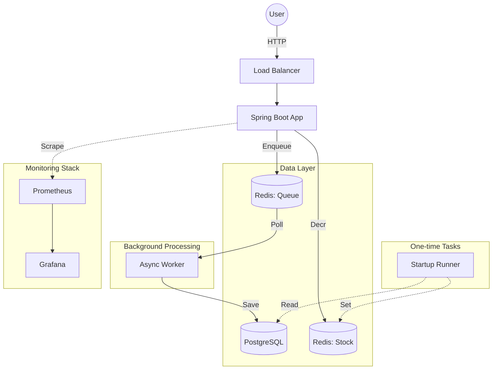
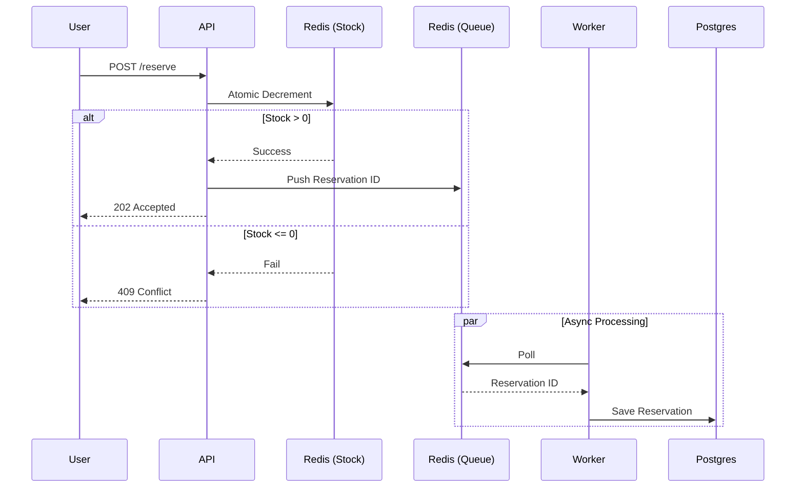
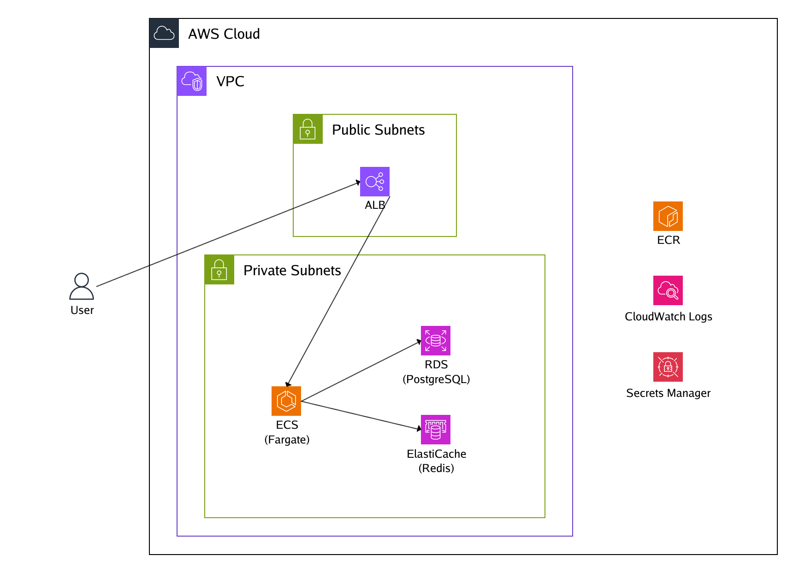

# Deployable Ticket System

A ticket reservation API built with Spring Boot.
Uses Redis to handle high traffic and Postgres for persistency.

## Request flow

1. **Request:** A user asks for a ticket.
2. **Redis:** The app checks stock in Redis. If there is a ticket, it takes one and responds immediately.
3. **Database:** Scheduled async job takes the request from a Redis queue and saves it to Postgres.

## Architecture Diagram



## Reservation Sequence



## Running it locally

Need Docker installed.

```bash
docker compose up -d --build
```

**Monitoring (Local Only):**
The local version includes a monitoring stack to see performance in real-time:

* **Grafana:** `localhost:13000`
* **Prometheus:** `localhost:19090`

## Load Testing

I used k6 for stress testing. Locally, it processes over 10,000 requests per second with one instance.

```bash
k6 run -e TICKET_ID=<TICKET_ID> load-test.js
```

## AWS Deployment (Terraform)

The `terraform/` folder has the code to deploy this to AWS. Note that the AWS version is minimal and does not include the Grafana/Prometheus stack to save on costs.

### AWS Infrastructure Diagram



*Diagram generated using [Diagram-as-code](https://github.com/awslabs/diagram-as-code).*
